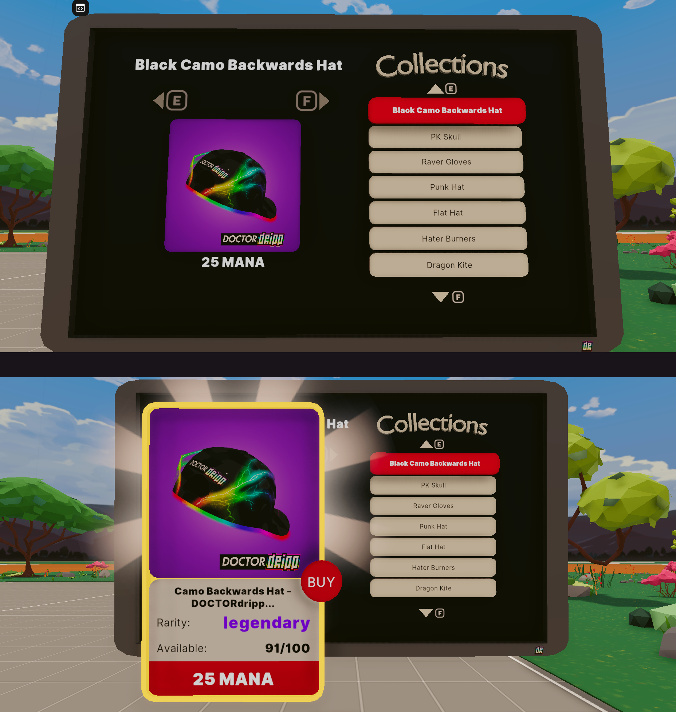

# Flat Screen TV version of the Decentraland Wearable Store (SDK7-ready)
by DOCTORdripp

This 1-tier flat screen revision can be repurposed onto any flat surface. Optionally replace `models/menu/wardrobe.glb` with your custom model (or an empty model) if you wish to position a flat store on a wall.

---

## Wearables Store

This store allows you to browse and purchase wearables on the Polygon L2 network from inside Decentraland’s **new explorer** (web / desktop / VR).

By default, it displays **all wearables on sale in L2**. You can also configure it to show only specific collections, for example to create a private store with just your wearables.



---

## Try it out

Make sure you have the [Decentraland Explorer](https://decentraland.org/download/) installed, or use the [Web version](https://play.decentraland.org/).

**Previewing the scene locally (SDK7):**

1. Download this repository and open the project folder in your terminal.
2. Install dependencies (only once):

   ```bash
   npm install
   ```

3. Start the preview in the new explorer:

   ```bash
   npm run start-new-explorer
   ```

The CLI will compile your scene and launch it in the new Decentraland explorer for local testing.

> **Note:** To test purchasing functionality, make sure you have a Web3 browser extension (like MetaMask) installed and connected.

Learn more about building scenes in the [Decentraland Docs](https://docs.decentraland.org/creator/development-guide/sdk7/introduction/).

If something doesn’t work, please [file an issue](https://github.com/decentraland-scenes/Awesome-Repository/issues/new).

---

## Scene usage

- Click the menu on the right to browse different collections.
- When a collection is selected, use your mouse or controller to scroll through the items.
- Click on an item to see more details.

To buy an item, click the **Buy** button. Make sure you’re connected with a Web3 wallet and have MANA on Polygon.

On your first transaction, you’ll be asked to **approve** the contract to spend your Polygon MANA. This approval is free of charge (it runs on Polygon).

After that, purchases require **no gas fees**—just the MANA cost of the item. Confirm the purchase by signing the transaction in your wallet.

---

## Customize

In `src/index.ts`, you'll find an example of creating a store with custom collections:

```ts
  createWearableStore(
    {
      position: Vector3.create(8, 0, 4),
      scale: Vector3.create(1, 1, 1),
      rotation: Quaternion.fromEulerDegrees(0, 90, 0)
    },
    [
      'urn:decentraland:matic:collections-v2:0x02048643e32f893406dc2012a2f48a3023645612',
      'urn:decentraland:matic:collections-v2:0x01cc9871ef405b71dd797c1423c7771942fd8258',
      'urn:decentraland:matic:collections-v2:0x01b35f5ed8a2d01d5746ec691165eceb64517202',
      'urn:decentraland:matic:collections-v2:0x016a61feb6377239e34425b82e5c4b367e52457f',
      'urn:decentraland:matic:collections-v2:0x0162ba693322bcc4c9198547fe7fbb4fa751db95',
      'urn:decentraland:matic:collections-v2:0x00ea0379451527a5cd56e2c4bb0eac950ccb79fa',
      'urn:decentraland:matic:collections-v2:0x00c1f53e8e1b97e619bdf555fff187521b3e3e17'
    ]
  )
```

The `createWearableStore()` function takes:

- A transform object with `position`and `rotation`. Paremeter `scale` must be 1,1,1
- An **optional** array of collection URNs to display.  
  - If none are provided, all Polygon L2 wearables are shown.

---

## Copyright

This scene is licensed under the standard **Apache 2.0 License**. See the terms and conditions in the [LICENSE](/LICENSE) file.
